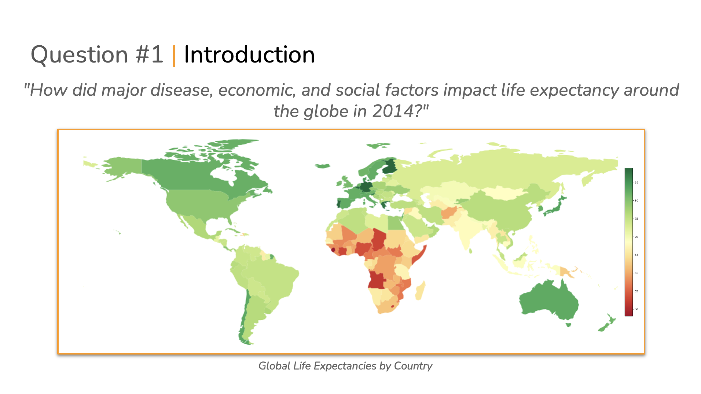
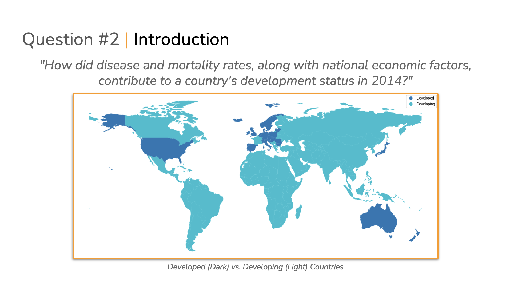

# Model and Representation of Data (IDS 702) Final Project

### Team Orange: [Pooja Kabber](https://www.linkedin.com/in/poojakabber/), [Echo Chen](https://www.linkedin.com/in/echochenxy/), [Dingkun Yang](https://www.linkedin.com/in/dyang7/), and [Andrew Kroening](https://www.linkedin.com/in/andrew-kroening/).

<!-- TABLE OF CONTENTS -->

  
Table of Contents

  <ol>
    <li>
      <a href="#presentation">Presentation of the Project</a>
      <ul>
        <li><a href="#slides">PPT Slides</a></li>
      </ul>
    </li>
    <li>
      <a href="#overview">Overview</a>
    </li>
    <li><a href="#repository-contents">Repository Contents</a></li>
    <li><a href="#structure">Structure</a></li>
  </ol>

<!-- Presentation -->
### Presentation

Click on the image and watch our presentation on YouTube

or visit url: https://youtu.be/iyczaHrG9HI

(<a href="#readme-top">back to top</a>)

#### Slides

[Presentation Slides](./Team_Presentation.pdf)

<!-- Overview -->
### Overview

In this project, our team attempted to find new insights into factors that drive human well-being around the world. We specifically look to investigate two areas: life expectancy and country development status with the goal of providing insights to policy and decision makers. Check out the presentation or report if you want the full summary, but here's a hint:

*Stay in school*

<!-- Repository Contents -->
### Repository Contents:

* [Proposal](./Project%20Proposal/Orange_Proposal.pdf)...............04 October
* [EDA Report](./Part%201%20-%20EDA/Orange_Part_1.pdf)...........21 October
* [Analysis Plan](./Part%202%20-%20Modeling/Orange_Part_2.pdf)........04 November
* [Final Report](./Part%203%20-%20Report/Orange_Part_3.pdf)..........02 December
* [Presentation](.//README.md#presentation).........01 December

<!-- Structure -->
### Structure:

* [Datasets](./Datasets) - This is where the datasets for the project are stored
* [Workspace](./Workspace) - This is where individual analyses can be conducted
* [Part 1 - EDA](./Part%201%20-%20EDA) - Final files for EDA
* [Part 2 - Analysis Plan](./Part%202%20-%20Modeling) - Final files for Modeling
* [Part 3 - Report](./Part%203%20-%20Report) - Final files for Report
